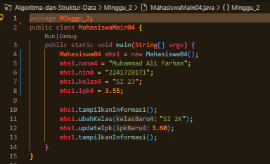
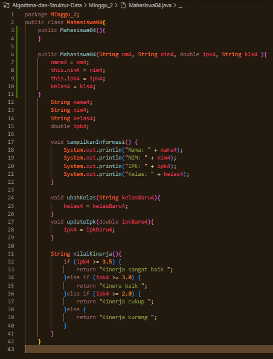
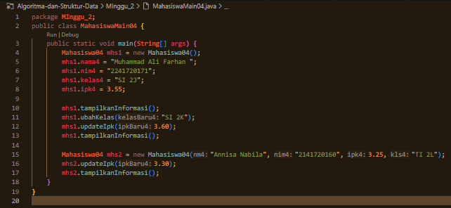
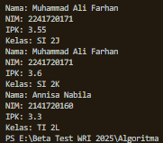
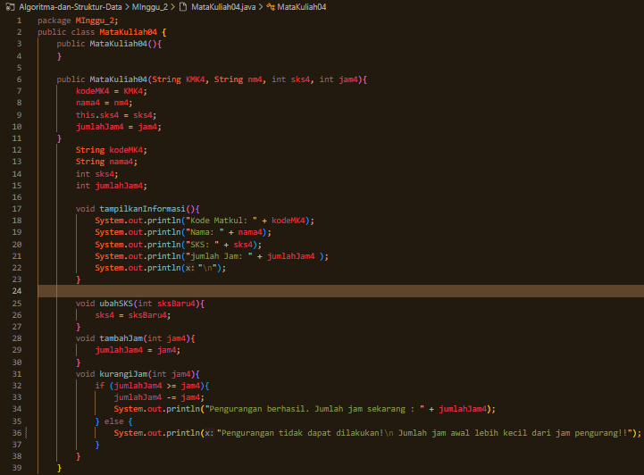

|  | Algoritma dan Struktur Data |
|--|--|
| NIM |  254107020087 |
| Nama |  Aryakavi Raditya Imaran |
| Kelas | TI - 1F |
| Repository | ([https://github.com/aryakavi/Algoritma-dan-Struktur-Data]) |

# JOBSHEET 2 : OBJECT
Mengenal objek dan class sebagai konsep mendasar pada pemrograman berorientasi objek

## 2.1 Percobaan 1: Deklarasi Class, Atribut dan Method  
Pada Percobaan 1 ini dilakukan pembuatan class beserta atribut dan method yang dimilikinya.

### 2.1.1 Langkah-langkah percobaan
Kode java untuk langkah langkah percobaan pertama sebagai berikut.

### 2.1.2 Verifikasi Hasil Percobaan
Sementara saat di jalankan kode tersebut akan mengeluarkan error seperti ini :

### 2.1.3 Pertanyaan

## 2.2 Percobaan 2: Instansiasi Object, serta Mengakses Atribut dan Method
Sampai tahap ini, class Mahasiswa telah berhasil dibuat pada Percobaan 1. Selanjutnya, apabila 
class Mahasiswa tersebut ingin digunakan dan diakses atribut serta method-nya, maka perlu dibuat 
object/instance dari class Mahasiswa terlebih dahulu melalui proses instansiasi. 

### 2.2.1 Langkah-langkah percobaan
Kode java untuk langkah langkah percobaan pertama sebagai berikut.

### 2.2.2 Verifikasi Hasil Percobaan
Sementara saat di jalankan kode tersebut akan mengeluarkan hasil seperti ini :

### 2.2.3 Pertanyaan

## 2.3 Percobaan 3: Membuat Konstruktor
Pada percobaan ini, dilakukan pembuatan kode program untuk mengimplementasikan berbagai 
macam konstruktor berdasarkan parameternya. 

### 2.3.1 Langkah-langkah percobaan
Kode java untuk langkah langkah percobaan pertama sebagai berikut.

- Untuk perubahan pertama

- Untuk perubahan kedua

### 2.3.2 Verifikasi Hasil Percobaan
Sementara saat di jalankan kode tersebut akan mengeluarkan hasil seperti ini :

### 2.3.3 Pertanyaan

## 2.4 Latihan Praktikum

### 2.4.1 Latihan 1 : MataKuliah
Kode java untuk langkah langkah percobaan pertama sebagai berikut.

Sementara saat di jalankan kode tersebut akan mengeluarkan hasil seperti ini :

### 2.4.1 Latihan 2 : Dosen
Kode java untuk langkah langkah percobaan pertama sebagai berikut.

Sementara saat di jalankan kode tersebut akan mengeluarkan hasil seperti ini :

# OUTRO
Sekian saya lampirkan kode saya untuk di nilai dan diberikan arahan, apabila ada masukkan atau kesalahan bisa kontak saya melalui

Whatsapp : 081358358676
Email    : aryakaviimaran2007@gmail.com

Terimakasih
