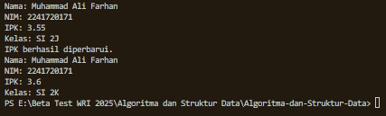
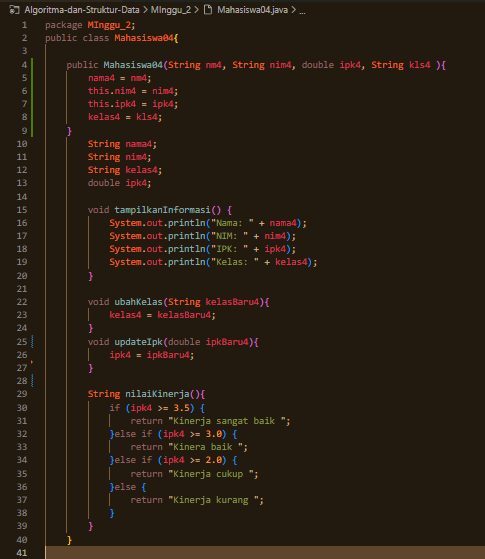
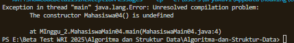
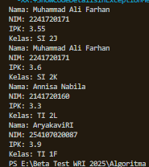

|  | Algoritma dan Struktur Data |
|--|--|
| NIM |  254107020087 |
| Nama |  Aryakavi Raditya Imaran |
| Kelas | TI - 1F |
| Repository | ([https://github.com/aryakavi/Algoritma-dan-Struktur-Data]) |

# JOBSHEET 2 : OBJECT
Mengenal objek dan class sebagai konsep mendasar pada pemrograman berorientasi objek

## 2.1 Percobaan 1: Deklarasi Class, Atribut dan Method  
Pada Percobaan 1 ini dilakukan pembuatan class beserta atribut dan method yang dimilikinya.

### 2.1.1 Langkah-langkah percobaan
Kode java untuk langkah langkah percobaan pertama sebagai berikut.


### 2.1.2 Verifikasi Hasil Percobaan
Sementara saat di jalankan kode tersebut akan mengeluarkan error seperti ini :


### 2.1.3 Pertanyaan
1. Sebutkan dua karakteristik class atau object!
   - Atribut : Data atau variabel yang mendefinisikan keadaan atau ciri dari objek (contoh : nama4, nim4, ipk4).
   - Method : Fungsi atau prosedur yang mendefinisikan perilaku atau apa yang dapat dilakukan oleh objek tersebut (contoh : tampilkanInformasi(), updateIpk()).

2. Perhatikan class Mahasiswa pada Praktikum 1 tersebut, ada berapa atribut yang dimiliki oleh class 
Mahasiswa? Sebutkan apa saja atributnya!
   - nama4 (String)
   - nim4 (String)
   - kelas4 (String)
   - ipk4 (double)

3. Ada berapa method yang dimiliki oleh class tersebut? Sebutkan apa saja methodnya!
   - tampilkanInformasi()
   - ubahKelas(String kelasBaru4)
   - updateIpk(double ipkBaru4)
   - nilaiKinerja()
  
4. Perhatikan method updateIpk() yang terdapat di dalam class Mahasiswa. Modifikasi isi method tersebut sehingga IPK yang dimasukkan valid yaitu terlebih dahulu dilakukan pengecekan apakah IPK yang dimasukkan di dalam rentang 0.0 sampai dengan 4.0 (0.0 <= IPK <= 4.0). Jika IPK tidak pada rentang tersebut maka dikeluarkan pesan: "IPK tidak valid. Harus antara 0.0 dan 4.0".
   
   
   
   

6. Jelaskan bagaimana cara kerja method nilaiKinerja() dalam mengevaluasi kinerja mahasiswa,  
kriteria apa saja yang digunakan untuk menentukan nilai kinerja tersebut, dan apa yang 
dikembalikan (di-return-kan) oleh method nilaiKinerja() tersebut?
   - Cara kerja :
        Method bekerja menggunakan struktur kontrol percabangan (if-else if-else). Method memerika nilai yang tersimpan di ipk4. Pengecekan dilakukan secara berurutan dari nilai terbesar ke tersecil. Begitu satu kondisi terpenuhi, method akan langsung mengembalikan nilai string yang sesuai dan berhenti mengecek kondisi dibawahnya.
   - Kriteria :
     1. Jika ipk4 lebih besar atau sama dengan 3.5, statusnya "Kinerja sangat baik".
     2. Jika ipk4 lebih besar atau sama dengan 3.0 (tetapi di bawah 3.5), statusnya "Kinera baik" (sesuai teks asli kode Anda).
     3. Jika ipk4 lebih besar atau sama dengan 2.0 (tetapi di bawah 3.0), statusnya "Kinerja cukup".
     4. Jika ipk4 kurang dari 2.0, statusnya "Kinerja kurang".
   - Yang dikembalikan (return) :
        Method mengembalikan data bertipe String, yang berisi kalimat status kinerja mahasiswa sesuai kriteria. (contoh: " Kinerja sangat baik").

8. Commit dan push kode program ke Github
   - Baiklah 👍


## 2.2 Percobaan 2: Instansiasi Object, serta Mengakses Atribut dan Method
Sampai tahap ini, class Mahasiswa telah berhasil dibuat pada Percobaan 1. Selanjutnya, apabila 
class Mahasiswa tersebut ingin digunakan dan diakses atribut serta method-nya, maka perlu dibuat 
object/instance dari class Mahasiswa terlebih dahulu melalui proses instansiasi. 

### 2.2.1 Langkah-langkah percobaan
Kode java untuk langkah langkah percobaan pertama sebagai berikut.


### 2.2.2 Verifikasi Hasil Percobaan
Sementara saat di jalankan kode tersebut akan mengeluarkan hasil seperti ini :


### 2.2.3 Pertanyaan
1. Pada class MahasiswaMain, tunjukkan baris kode program yang digunakan untuk proses instansiasi! Apa nama object yang dihasilkan?
```java
Mahasiswa04 mhs1 = new Mahasiswa04();
```
   - dan nama objek yang dihasulkan adalah mhs1.

2. Bagaimana cara mengakses atribut dan method dari suatu objek?
   - Cara mengakses atribut dan method dari suatu objek adalah menggunakan operator titik (.) setelah nama objeknya. dengan sintaks **namaObjek.namaAtribut** atau **namaObjek.namaMethod()**
   _contoh :_
   _mengakses atribut:  mhs1.nama4 = "Muhammad Ali Farhan";_
   _mengakses method: mhs1.tampilkanInformasi();_

3. Mengapa hasil output pemanggilan method tampilkanInformasi() pertama dan kedua berbeda?
   - hasil output berbeda karena terjadi perubahan data pada objek mhs1 di antara pemanggil pertama dan kedua. 
   1. Pada pemanggilan pertama, method tampilkanInformasi() mencetak data awal (Kelas: "SI 2J", IPK: 3.55).
   2. Setelah itu, baris kode mhs1.ubahKelas("SI 2K"); dan mhs1.updateIpk(3.60); dijalankan. Kedua method ini mengubah nilai kelas4 dan ipk4 yang tersimpan di dalam mhs1.
   - Oleh karena itu, saat tampilkanInformasi() dipanggil kedua kalinya, ia mencetak data yang sudah diperbarui (Kelas: "SI 2K", IPK: 3.60).

## 2.3 Percobaan 3: Membuat Konstruktor
Pada percobaan ini, dilakukan pembuatan kode program untuk mengimplementasikan berbagai 
macam konstruktor berdasarkan parameternya. 

### 2.3.1 Langkah-langkah percobaan
Kode java untuk langkah langkah percobaan pertama sebagai berikut.

- Untuk perubahan pertama


- Untuk perubahan kedua


### 2.3.2 Verifikasi Hasil Percobaan
Sementara saat di jalankan kode tersebut akan mengeluarkan hasil seperti ini :


### 2.3.3 Pertanyaan
1. Pada class Mahasiswa di Percobaan 3, tunjukkan baris kode program yang digunakan untuk mendeklarasikan konstruktor berparameter!
```java
public Mahasiswa04(String nm4, String nim4, double ipk4, String kls4 ){
    nama4 = nm4;
    this.nim4 = nim4;
    this.ipk4 = ipk4;
    kelas4 = kls4;
}
```

2. Apa sebenarnya yang dilakukan pada baris program _Mahasiswa04 mhs2 = new Mahasiswa04("Annisa Nabila", "2141720160", 3.25, "TI 2L");_ ?
   - Menciptakan objek baru dari class Mahasiswa04.
   - Memanggil konstruktor berparameter untuk mengisi nilai awal atribut nama4, nim4, ipk4, dan kelas4 dengan data yang ada di dalam kurung ("Annisa Nabila", "2141720160", dst) saat objek tersebut pertama kali dibuat.
  
3. Hapus konstruktor default pada class Mahasiswa, kemudian compile dan run program. Bagaimana hasilnya? Jelaskan mengapa hasilnya demikian!
   - Hasilnya program akan error, penyebab error terjadi pada baris _Mahasiswa04 mhs1 = new Mahasiswa04();_ di _MahasiswaMain04_
     - Jika sudah membuat konstruktor berparameter secara manual, maka Java tidak perlu membuatkan konstruktor default secara otomatis. Karena konstruktor default dihapus manual dan Java tidak menyediakannya lagi, maka perintah _new Mahasiswa()_ kehilangan rujukan konstruktornya sehingga program jadi error.

   
   
   
   
5. Setelah melakukan instansiasi object, apakah method di dalam class Mahasiswa harus diakses secara berurutan? Jelaskan alasannya!
   - Tidak, method tidak harus diakses secara berurutan sesuai urutan penulisan di class.
   - Method bersifat independen, bebas memanggil method mana saja kapanpun sesuai dengan kebutuhan.
   _Contoh : **ubahKelas()** boleh dipanggil terlebih dahulu baru **tampilkanInformasi()**, atau sebaliknya_
   _Namun meskipun urutan pembanggilan bebas secara sintaks, urutan pemanggilan akan akan mempengaruhi data/output. (misalnya jika menampilkan info sebelum di update data yang lama akan muncul)._

6. Buat object baru dengan nama mhs<NamaMahasiswa> menggunakan konstruktor 
berparameter dari class Mahasiswa!

   

   

8. Commit dan push kode program ke Github!
   - Baiklah 👍

## 2.4 Latihan Praktikum

### 2.4.1 Latihan 1 : MataKuliah
Kode java untuk langkah langkah percobaan pertama sebagai berikut.


Sementara saat di jalankan kode tersebut akan mengeluarkan hasil seperti ini :


### 2.4.1 Latihan 2 : Dosen
Kode java untuk langkah langkah percobaan pertama sebagai berikut.


Sementara saat di jalankan kode tersebut akan mengeluarkan hasil seperti ini :


# OUTRO
Sekian saya lampirkan kode saya untuk di nilai dan diberikan arahan, apabila ada masukkan atau kesalahan bisa kontak saya melalui

- Whatsapp : 081358358676
- Email    : aryakaviimaran2007@gmail.com

Terimakasih
