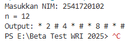
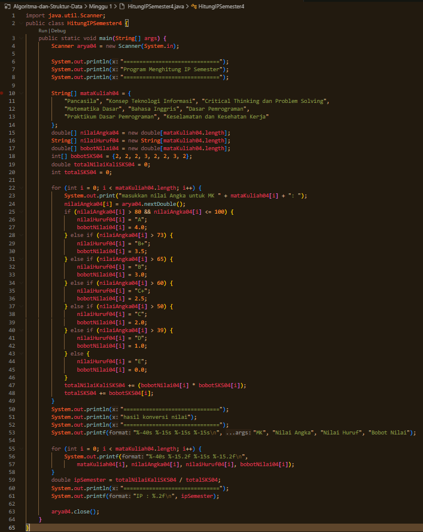
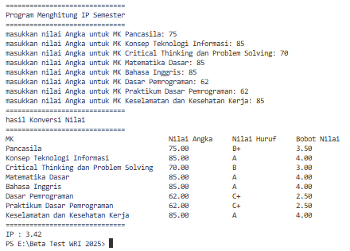
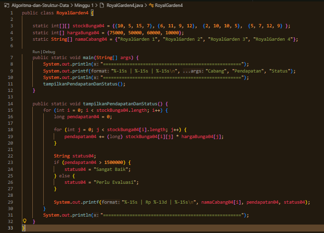
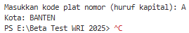
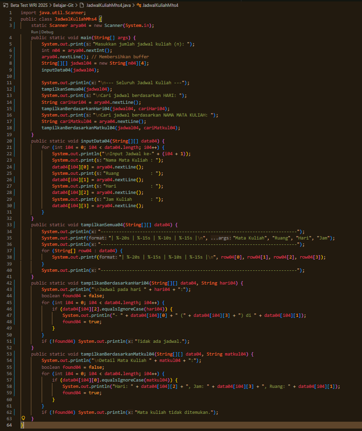

|  | Algoritma dan Struktur Data |
|--|--|
| NIM |  254107020087|
| Nama |  Aryakavi Raditya Imaran |
| Kelas | TI - 1F |
| Repository | ([https://github.com/jti-polinema/-01-contoh-laporan-react](https://github.com/aryakavi/Algoritma-dan-Struktur-Data)) |

# JOBSHEET 1 : KONSEP DASAR PEMROGRAMAN

## 2.1 Pemilihan

### 2.2.1 Praktikum Pemilihan 

The Code

The Answers (Tadaaa.. Idk what to put here)

**Brief explanation:** There are 4 steps for this code to work :
1. Collect scores for Tugas, Kuis, UTS, and UAS.
2. Ensure all inputs are between 0 and 100.
3. Compute the weighted final score and letter grade.
4. Output the "LULUS" or "TIDAK LULUS" status.

## 2.2 Perulangan 

### 2.3.1 Praktikum Perulangan

The Code

The Answers

**Brief explanation:** There are 3 steps for this code to work :
1. Calculate the loop limit based on the user's NIM.
2. Iterate from 1 to limit while skipping 10 and 15.
3. Print symbols (# or *) or numbers based on divisibility.

## 2.3 Array

### 2.4.1 Praktikum Array

The Code

The Answers

**Brief explanation:** There are 4 steps for this code to work :
1. Collect numerical grades for 8 subjects.
2. Map numbers to letter grades and GPA weights.
3. Calculate total weighted points and total SKS.
4. Display a formatted table and the final IP.

## 2.4 Fungsi

### 2.5.1 Praktikum Fungsi 

The Code

The Answers

**Brief explanation:** There are 3 steps for this code to work :
1. Use hardcoded stock and price values (no user input).
2. Calculate revenue and evaluate status for each branch.
3. Output the results in a formatted table.

## TUGAS

### Tugas 1
The Code

The Answers

**Brief explanation:** There are 4 steps for this code to work :
1. Define the arrays for plate codes and city names.
2. User enters a single plate character.
3. Match the input against the code array.
4. Display the city name or an error if not found.
   
### Tugas 2
The Code

The Answers

**Brief explanation:** There are 5 steps for this code to work :
1. Determine the number of schedules.
2. Input all details (Course, Room, Day, Time) into a 2D array.
3. Print the full schedule table.
4. User searches and views specific days.
5. User searches and views specific subject details.

